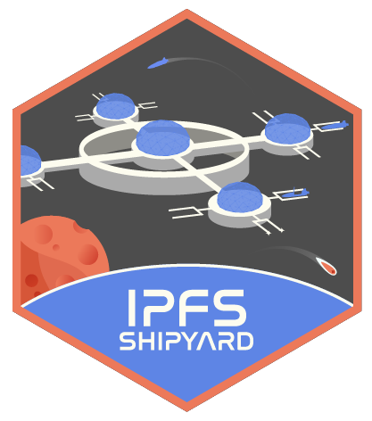

<h1 align="center">
  
</h1>

### IPFS Shipyard is a space for us to incubate new ideas, experiments, and create specialized repositories that do not belong to the core of the IPFS Protocol. These projects deserve its own dedicated Github Org, so that these don't sunk under the hundreds of repos existent the IPFS, libp2p, IPLD and multiformats Github orgs.
